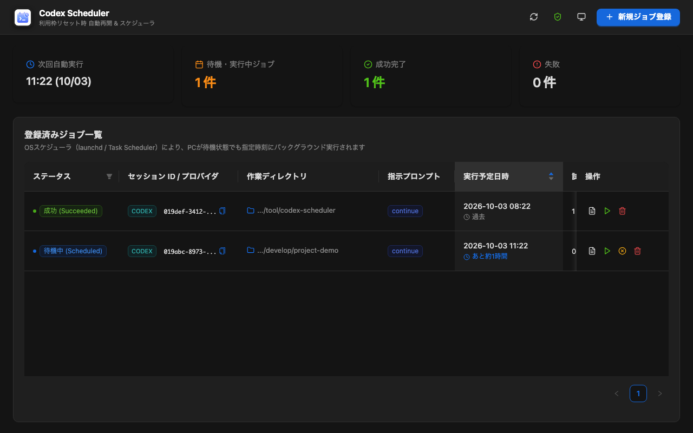

# Codex Scheduler

利用枠（Quota / Rate Limit）リセット時に自動でセッションを再開する、ローカルファーストのスケジュール管理デスクトップアプリケーション。

<p align="left">
  
  
  
  
  
  
  
  
</p>



普段CodexデスクトップアプリやCLIで開発している際、トークン利用制限（Rate Limit）に達して作業が中断してしまうことがあります。  
**Codex Scheduler** を使えば、就寝前にセッションIDと作業ディレクトリを登録しておくだけで、夜間のリセット時刻（例: 深夜2時）に自動で `"continue"` を送信し、バックグラウンドで作業を再開。  
翌朝PCを開いた際には、**何事もなかったかのように同一セッションの続きから作業を完了・継続**できます。

---

## 主な特徴

- 🔄 **Desktop-first 運用に完全準拠**  
  Codexデスクトップアプリ、CLI、IDEで同一のローカルセッションDBが共有される仕組みを活用し、深夜に外部から非対話で安全に再開（`codex exec resume <session_id> "continue"`）を実行します。
- ⏰ **OSネイティブスケジューラ連携（省電力 & 高信頼性）**  
  アプリ自身が深夜まで常駐し続ける必要はありません。macOS では OS 標準のスケジューラ（`launchd` LaunchAgent）に委譲するため、アプリを終了していても指定時刻以降にバックグラウンド起動して確実に実行します（定期確認により通常1分以内に開始）。※ Windows 環境での常設 Task Scheduler 連携は次期アップデートで対応予定です。
- 🛡️ **インテリジェント・リトライポリシー**  
  リセット予定時刻の微小なズレ（数分の遅延）や一時的な利用制限超過（HTTP 429等）を自動判定。設定間隔（例: 5分おき）で成功するまで自動再試行します。
- 🎨 **Ant Design による洗練されたモダンUI**  
  ダークモード／ライトモード切り替え、カウントダウンタイマー、直感的なジョブ登録モーダル、ターミナル風の実行履歴ログ表示を標準装備。

---

## 技術スタック

| 分野 | 技術 |
| :--- | :--- |
| **バックエンド / コア** | [Rust](https://www.rust-lang.org/) / [Tauri v2](https://tauri.app/) |
| **フロントエンド** | [React 19](https://react.dev/) / [TypeScript](https://www.typescriptlang.org/) / [Vite](https://vitejs.dev/) |
| **UIコンポーネント** | [Ant Design 5](https://ant.design/) / [Lucide Icons](https://lucide.dev/) |
| **OSスケジューラ** | macOS `launchd` (LaunchAgent) / Windows Task Scheduler (対応予定) |

---

## インストール手順

[GitHub Releases](https://github.com/kamahir0/codex-scheduler/releases) より、お使いのOSに合わせたインストーラをダウンロードしてください。

### 配布パッケージ一覧

| 種別 | OS / アーキテクチャ | 配布ファイル | 用途 |
| :--- | :--- | :--- | :--- |
| **Desktop GUI** | macOS (Apple Silicon M1〜M4) | `Codex-Scheduler-<version>-macos-arm64.dmg` | GUIデスクトップアプリ |
| **Desktop GUI** | Windows (64-bit) | `Codex-Scheduler-<version>-windows-x64.exe` | GUIデスクトップインストーラ |
| **Standalone CLI** | macOS (Apple Silicon M1〜M4) | `Codex-Scheduler-CLI-<version>-macos-arm64` | 単体CLI実行ファイル (`codex-scheduler`) |

※ Windows 環境では現行バージョンにおいて常設バックグラウンド実行（Task Scheduler連携）は未実装（次期アップデートで対応予定）であり、Desktop GUI アプリ起動中のジョブ管理・手動実行に対応しています。

### 前提条件
本スケジューラはバックグラウンドで `codex` コマンドを実行します。端末に OpenAI Codex CLI がインストールされていることを確認してください。
```bash
codex --version
```

### macOS の場合
1. ダウンロードした `.dmg` ファイルを開き、`Codex Scheduler.app` を **Applications（アプリケーション）** フォルダへドラッグ＆ドロップします。
2. アプリケーションフォルダから起動します。
> [!NOTE]
> 初回起動時に「開発元を確認できないため開けません」と表示された場合は、Finder でアプリを **右クリック（Control + クリック）して「開く」** を選択するか、ターミナルで以下を実行して隔離属性を解除してください：
> ```bash
> xattr -d com.apple.quarantine /Applications/Codex\ Scheduler.app
> ```

### Windows の場合
1. ダウンロードした `.exe` ファイルを実行し、ウィザードに従ってインストールします。
> [!NOTE]
> Microsoft Defender SmartScreen が表示された場合は、「詳細情報」をクリックしてから「実行」を選択してください。

### Standalone CLI の場合 (macOS Apple Silicon: `codex-scheduler`)
Releases からバイナリをダウンロードし、実行権限を付与して PATH の通った場所に配置します：
```bash
chmod +x Codex-Scheduler-CLI-*-macos-arm64
mv Codex-Scheduler-CLI-*-macos-arm64 ~/.local/bin/codex-scheduler

# ジョブの登録例
codex-scheduler schedule --session-id "sess-123" --cwd "/path/to/project" --at "+120"

# 一覧表示
codex-scheduler list --json
```

※ Desktop アプリと CLI を同一環境に導入した場合でも、`~/.codex-scheduler/jobs.json` のジョブデータは共有され、macOS の常設スケジューラ（LaunchAgent）は常に1つに保たれます（Desktop所有が優先）。

より詳しい権限仕様やセットアップ手順については [インストール & 権限セットアップガイド](docs/setup-guide.md) をご覧ください。

---

## 開発・ビルド（コントリビューター向け）

```bash
# 依存関係のインストール
npm install

# 開発用デスクトップアプリの起動
npm run gui:dev

# テスト実行 & ビルド確認
cargo test -p codex-scheduler-core -p codex-scheduler-cli
npm --workspace @codex-scheduler/gui run lint
npm --workspace @codex-scheduler/gui run build
```
